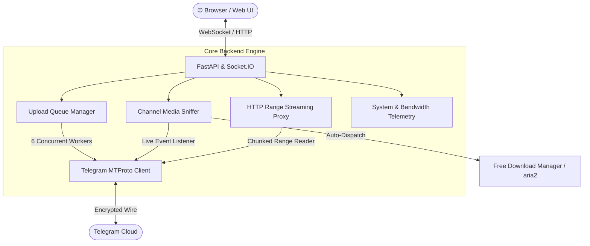

# 🚀 TG Power Suite

<div align="center">


**High-Performance MTProto Uploader, Channel Media Sniffer & Streaming Proxy with Real-Time Telemetry**

</div>

---

## 📖 Overview

**TG Power Suite** is an enterprise-grade Telegram power tool designed for seamless large file uploads and high-speed media downloading. It combines a turbo MTProto 6-worker upload engine with zero-copy splitting (for files > 2GB) and an intelligent channel sniffer that auto-dispatches incoming media directly to **Free Download Manager (FDM)**, **aria2**, or **NeatDM**.



---

## ✨ Key Features

### 📤 Turbo MTProto Uploader
- **2GB+ Auto-Splitting**: Zero-copy byte range slicing splits massive files into sequence parts (`.part001`, `.part002`) seamlessly.
- **6-Worker Parallel Pipeline**: Maximizes upload throughput across Telegram MTProto data centers.
- **Batch Controls**: `Pause All`, `Resume All`, `Clear Done`, and `Cancel All` toolbar actions.
- **Destination Dialog Picker**: Searchable modal for choosing channels, groups, bots, or Saved Messages.

### 📥 Sniffer & FDM Streaming Proxy
- **Real-Time Channel Monitoring**: Watches 1,400+ dialogs, channels, bots, and contacts for incoming media.
- **1-Click Auto-Dispatch**: Direct integration with Free Download Manager, aria2, and NeatDM.
- **HTTP Range Streaming**: Supports multi-threaded parallel downloads and full byte-range seeking.

### 📊 Real-Time Bandwidth Telemetry & History
- **Live Throughput Sparkline**: Smooth 60-second canvas graph tracking network transfer rates.
- **System Metrics**: Real-time CPU, RAM, active proxy streams, and connection latency meters.
- **Audit Logs & Export**: Filter transfer history and export to **CSV** or **JSON** with one click.

---

## 🚀 Quick Start

### Option 1: Native Systemd (Recommended for Linux)

```bash
# Clone repository
git clone https://github.com/myselfnandha/TG_TOOL.git
cd TG_TOOL/TG_WEB

# Run automated installer (creates virtualenv, desktop shortcuts, and systemd service)
./linux/install.sh

# Open Web UI
xdg-open http://localhost:8088
```

### Option 2: CLI Server Runner

```bash
cd TG_WEB
./venv/bin/python backend/run.py start
```

### Option 3: Docker & Docker Compose

```bash
cd TG_WEB
docker compose up -d --build
```

---

## 📡 API Reference

| Endpoint | Method | Description |
| :--- | :---: | :--- |
| `/api/system/stats` | `GET` | Real-time CPU, RAM, active bandwidth, and uptime |
| `/api/upload` | `POST` | Chunked file upload streaming to MTProto queue |
| `/api/upload/batch/pause` | `POST` | Pauses all active upload tasks |
| `/api/upload/batch/resume` | `POST` | Resumes all paused upload tasks |
| `/api/upload/batch/clear` | `POST` | Clears completed tasks from active queue |
| `/api/chats` | `GET` | Fetches user channels, groups, bots, and address book |
| `/api/sniffer/status` | `GET` | Active watched channels and detected managers |
| `/api/sniffer/channels/add` | `POST` | Adds a channel to the sniffer watchlist |
| `/api/dl/{chat_id}/{msg_id}/{name}` | `GET` | High-speed HTTP range proxy streaming endpoint |
| `/api/history` | `GET` | Complete transfer audit history |
| `/api/settings` | `POST` | Updates download manager preferences and speed limits |

---

## 🛡️ License

Released under the [MIT License](LICENSE).
